# Modules

1. UI design and components [Nuxt ui](https://ui.nuxt.com/getting-started/installation)
2. To use typography without overloading the applicacion [Nuxt Fonts](https://fonts.nuxt.com/get-started/installation)
3. Provides an efficient and easy way to access a wide variety of utilities without overloading your application with unnecessary code. [VueUse](https://vueuse.org/guide)
4. For nuxt security [Nuxt Security](https://nuxt.com/modules/security)
5. [Prisma ORM](https://www.prisma.io/docs/guides/nuxt) with [Extension-Accelerate](https://www.npmjs.com/package/@prisma/extension-accelerate)

# DBML

```mermaid
erDiagram
    Usuario ||--o{ Rol : "ID_rol"
    Usuario ||--o{ RegistroActividad : "ID_usuario"
    Usuario ||--o{ Reporte : "ID_usuario"
    Animal ||--o{ Genealogia : "ID_animal"
    Animal ||--o{ HistorialPeso : "ID_animal"
    Animal ||--o{ EventoReproductivo : "ID_animal"
    Animal ||--o{ Tratamiento : "ID_animal"
    Animal ||--o{ Venta : "ID_animal"
    Animal ||--o{ Vacuna : "ID_animal"
    Genealogia }|--|| Animal : "padre_id"
    Genealogia }|--|| Animal : "madre_id"
    Inventario }|--|| Proveedor : "ID_proveedor"

    Usuario {
        varchar(500) ID_usuario PK
        varchar(500) nombre
        varchar(500) email
        varchar(500) contrasena
        varchar(500) ID_rol FK
    }

    Rol {
        varchar(500) ID_rol PK
        varchar(500) nombre
        enum acciones
        enum modulos
    }

    Animal {
        varchar(500) ID_animal PK
        varchar(500) nombre
        date fecha_nacimiento
        date fecha_fallecimiento NOT NULL
        varchar(500) raza
        decimal peso_inicial
        decimal peso_final NOT NULL
        boolean venta
        varchar(500) estado_salud
    }

    Genealogia {
        varchar(500) ID_genealogia PK
        varchar(500) ID_animal FK
        varchar(500) padre_id NOT NULL FK
        varchar(500) madre_id NOT NULL FK
        varchar(500) caracteristicas_raza NOT NULL
    }

    HistorialPeso {
        varchar(500) ID_registro PK
        date fecha
        decimal peso
        varchar(500) ID_animal FK
    }

    EventoReproductivo {
        varchar(500) ID_evento PK
        varchar(500) tipo
        date fecha
        varchar(500) notas
        varchar(500) ID_animal FK
    }

    Vacuna {
        varchar(500) ID_vacuna PK
        varchar(500) nombre
        int cantidad_implementada
        varchar(500) ID_animal FK
    }

    Tratamiento {
        varchar(500) ID_tratamiento PK
        varchar(500) nombre
        varchar(500) descripcion
        varchar(500) ID_animal FK
    }

    Inventario {
        varchar(500) ID_insumo PK
        varchar(500) descripcion_insumo
        int cantidad
        decimal precio
        varchar(500) ID_proveedor FK
        varchar(500) referencia_proveedor
    }

    Proveedor {
        varchar(500) ID_empresa PK
        varchar(500) nombre_empresa
        varchar(500) correo_empresa
        varchar(500) telefono
        varchar(500) direccion
    }

    Venta {
        varchar(500) ID_venta PK
        date fecha
        decimal precio
        varchar(500) ID_animal FK
    }

    RegistroActividad {
        varchar(500) ID_actividad PK
        timestamp fecha_hora
        varchar(500) accion
        varchar(500) ID_usuario FK
    }

    Reporte {
        varchar(500) ID_reporte PK
        text URL
        date fecha_generacion
        varchar(500) ID_usuario FK
    }

```



<details>
<summary>DBML</summary>
<br>

```dbml
Table "Usuario" {
  "ID_usuario" varchar(500) [pk]
  "nombre" varchar(500)
  "email" varchar(500)
  "contrasena" varchar(500)
  "ID_rol" varchar(500)
}

Table "Rol" {
  "ID_rol" varchar(500) [pk]
  "nombre" varchar(500)
  "acciones" enum
  "modulos" enum
}

Table "Animal" {
  "ID_animal" varchar(500) [pk]
  "nombre" varchar(500)
  "fecha_nacimiento" date
  "fecha_fallecimiento" date [not null]
  "raza" varchar(500)
  "peso_inicial" decimal
  "peso_final" decimal [not null]
  "venta" boolean
  "estado_salud" varchar(500)
}

Table "Genealogia" {
  "ID_genealogia" varchar(500) [pk]
  "ID_animal" varchar(500)
  "padre_id" varchar(500) [not null]
  "madre_id" varchar(500) [not null]
  "caracteristicas_raza" varchar(500) [not null]
}

Table "HistorialPeso" {
  "ID_registro" varchar(500) [pk]
  "fecha" date
  "peso" decimal
  "ID_animal" varchar(500)
}

Table "EventoReproductivo" {
  "ID_evento" varchar(500) [pk]
  "tipo" varchar(500)
  "fecha" date
  "notas" varchar(500)
  "ID_animal" varchar(500)
}

Table "Vacuna" {
  "ID_vacuna" varchar(500) [pk]
  "nombre" varchar(500)
  "cantidad_implementada" int
  "ID_animal" varchar(500)
}

Table "Tratamiento" {
  "ID_tratamiento" varchar(500) [pk]
  "nombre" varchar(500)
  "descripcion" varchar(500)
  "ID_animal" varchar(500)
}

Table "Inventario" {
  "ID_insumo" varchar(500) [pk]
  "descripcion_insumo" varchar(500)
  "cantidad" int
  "precio" decimal
  "ID_proveedor" varchar(500)
  "referencia_proveedor" varchar(500)
}

Table "Proveedor" {
  "ID_empresa" varchar(500) [pk]
  "nombre_empresa" varchar(500)
  "correo_empresa" varchar(500)
  "telefono" varchar(500)
  "direccion" varchar(500)
}

Table "Venta" {
  "ID_venta" varchar(500) [pk]
  "fecha" date
  "precio" decimal
  "ID_animal" varchar(500)
}

Table "RegistroActividad" {
  "ID_actividad" varchar(500) [pk]
  "fecha_hora" timestamp
  "accion" varchar(500)
  "ID_usuario" varchar(500)
}

Table "Reporte" {
  "ID_reporte" varchar(500) [pk]
  "URL" text
  "fecha_generacion" date
  "ID_usuario" varchar(500)
}

Ref "Animal_ID_animal_EventoReproductivo_ID_animal":"EventoReproductivo"."ID_animal" < "Animal"."ID_animal"

Ref "Animal_ID_animal_Genealogia_ID_animal":"Genealogia"."ID_animal" < "Animal"."ID_animal"

Ref "Animal_ID_animal_Genealogia_madre_id":"Genealogia"."madre_id" < "Animal"."ID_animal"

Ref "Animal_ID_animal_Genealogia_padre_id":"Genealogia"."padre_id" < "Animal"."ID_animal"

Ref "Animal_ID_animal_HistorialPeso_ID_animal":"HistorialPeso"."ID_animal" < "Animal"."ID_animal"

Ref "Animal_ID_animal_Tratamiento_ID_animal":"Tratamiento"."ID_animal" < "Animal"."ID_animal"

Ref "Animal_ID_animal_Venta_ID_animal":"Venta"."ID_animal" < "Animal"."ID_animal"

Ref "Proveedor_ID_empresa_Inventario_ID_proveedor":"Inventario"."ID_proveedor" < "Proveedor"."ID_empresa"

Ref "Rol_ID_rol_Usuario_ID_rol":"Usuario"."ID_rol" < "Rol"."ID_rol"

Ref "Usuario_ID_usuario_RegistroActividad_ID_usuario":"RegistroActividad"."ID_usuario" < "Usuario"."ID_usuario"

Ref "Vacuna_ID_animal_fk":"Animal"."ID_animal" < "Vacuna"."ID_animal"
```
</details>

## Setup

Make sure to install dependencies:

```bash
# npm
npm install

# pnpm
pnpm install

# yarn
yarn install

# bun
bun install
```

## Development Server

Start the development server on `http://localhost:3000`:

```bash
# npm
npm run dev

# pnpm
pnpm dev

# yarn
yarn dev

# bun
bun run dev
```

## Production

Build the application for production:

```bash
# npm
npm run build

# pnpm
pnpm build

# yarn
yarn build

# bun
bun run build
```

Locally preview production build:

```bash
# npm
npm run preview

# pnpm
pnpm preview

# yarn
yarn preview

# bun
bun run preview
```

Check out the [deployment documentation](https://nuxt.com/docs/getting-started/deployment) for more information.
